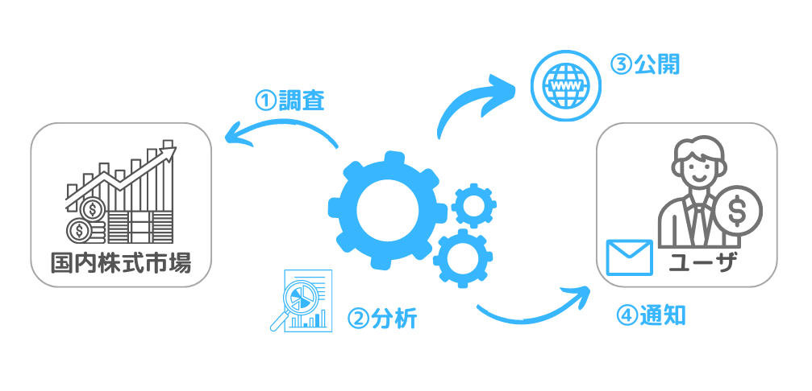

//==========
// 属性(Attribute)
//==========
:author: fukaor 
:revnumber:  0.1
:email: rey19951005@gmail.com
:last-update-label: 最終更新
:lang:      ja
:doctype:   book
:chapter-signifier: 
:toc: left
:toc-title: 目次
:scripts: cjk
:sectnumlevels: 4
:sectnums:
:figure-caption: 図
:table-caption: 表
:version-label: Ver.
:title-page-background-image: image:./img/title-page-back.png[]

= システム原案

== プロジェクト概要

=== 目的

システムによるWeb画面で表示される株式の分析結果及びメール通知の内容から、ユーザが調査の必要なく簡易に投資判断ができるようにすることを目的とする。

=== 概要

 * システムはRSI投資法によって投資対象として有望と判断できる株式を調査、分析する。
 * システムは分析した結果をメール及びWeb画面描画によってユーザに提供する。
 * システムはユーザのメールアドレスといった個人情報を保管していることから、提供するWeb画面にアクセスする際には認証を行う。
 * システム全体の概要図を下記に示す。

== 仕様

=== 分析処理仕様

==== 対象銘柄

調査及び分析の対象はJPX日経インデックス400の構成銘柄とする。JPX日経インデックス400の構成銘柄が更新された場合は、調査及び分析対象も更新する。

==== 通知先ユーザ

ユーザデータは暗号化した上で管理を行う。通知先ユーザデータとして下記を管理し、各ユーザデータは必要に応じて追加/変更/削除を可能とする。

.ユーザデータ一覧
[cols="1a*3", width=100%, options="header, autowidth"]
|===
2+| データ名 | 説明

2+| ユーザID
| ユーザごとに一意となるID

2+| アカウント名
| Web画面上で表示する名称

2+| パスワード
| 8桁以上20桁以下の英数字

2+| メールアドレス
| 通知先のメールアドレスを複数設定可能
|===

==== 投資判断種別

投資判断の種別は下記とする。

 * 買い準備
 * 買い
 * 売り準備
 * 売り

==== 分析方法

===== RSIの計算

TIP:  "A / (A + B) * 100" + 
      A_14日間の値上がり幅の平均、B_14日間の値下がり幅の平均

===== 25日移動平均線乖離率の計算

TIP:  "25日移動平均線 = （本日の終値 + 昨日の終値 + 2日前の終値 + … + 25日前の終値） / 25" + 
      "25日移動平均線乖離率 = （株価 - 25日移動平均線） / 25日移動平均線"

===== 75日移動平均線の計算

TIP:  "75日移動平均線 = （本日の終値 + 昨日の終値 + 2日前の終値 + … + 75日前の終値） / 75"

===== 投資判断にあたっての優先度

TIP:  全体相場（日経平均のRSI） > 対象銘柄のRSI > 対象銘柄の25日移動平均線乖離率 > 対象銘柄の75日移動平均線

===== 投資判断種別の設定

TIP:  RSIが25に達した場合、買い準備の判定 + 
      RSIが20に達した場合、買いの判定 + 
      RSIが75に達した場合、売り準備の判定 + 
      RSIが80に達した場合、売りの判定 + 
      25日移動平均線乖離率が-10%に達した場合、買いの判定 + 
      25日移動平均線乖離率が+10%に達した場合、売りの判定 + 
      75日移動平均線が+の場合、買いの判定 + 
      75日移動平均線が-の場合、売りの判定

===== 最終的な投資判断種別

IMPORTANT:  全体相場及び対象銘柄のRSIの両方に投資判断種別の設定がされた場合、ユーザへの通知対象とする。

==== 分析の実施時刻

東京証券取引所の休業日を除き、毎日2回実施する。実施時刻は売買立会の午後立会終了1時間前（14:00）及び午後立会終了時点（15:00）とし、実施時刻時点での市場情報をもとに分析を実施する。このとき、午後立会終了1時間前の分析結果は後立会終了30分前までに完了させる。

==== 要注意銘柄の判断

分析の結果投資対象と判断されており、かつ下記に該当する銘柄については要注意銘柄とする。

 * 事件、事故銘柄
// TODO 詳細な判断基準について書く
 * ストップ銘柄
// TODO 詳細な判断基準について書く
 * 出来高50万未満の銘柄

==== 分析結果

===== 画面表示

分析完了後、分析結果をWeb画面上で確認可能とする。Web画面仕様は後述。

===== メール通知

分析完了後、下記の情報を記載しユーザのメールアドレス宛にメールを送る。

.メール内容
[cols="1a*2", width=100%, options="header, autowidth"]
|===

| 項目 | 内容

| 調査実施日時
| yyyy/MM/dd hh:mm:ss表記

| URL
| 分析結果のURL

| 投資判断種別
| 分析の結果推奨される種別

| 対象銘柄名称及びコード
| 投資判断種別ごとにソートして表示

| 要注意銘柄の判断
| 該当する場合はその旨を表示

| 分析結果抜粋
| 全体相場（日経平均のRSI）、対象銘柄のRSI、対象銘柄の25日移動平均線乖離率、対象銘柄の75日移動平均線の投資判断種別をそれぞれ示す

|===

// メール文面のイメージ図を追加

===== データ保存

調査結果はCSVファイルで出力し保管する。30日以上前に出力したCSVファイルについては圧縮を行う。

=== 画面処理仕様

// TODO 画面周りの仕様はみんなで考えよう

==== 画面遷移

==== 画面イメージ

==== 画面仕様詳細

==== ログイン画面

